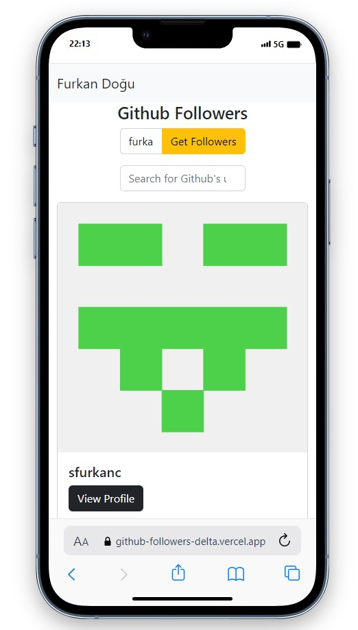

# GitHub Followers Web App

  

## About the Project

This web application allows users to find and view GitHub followers of a specific user.

## Features

- **Search by Username:** Enter a GitHub username to retrieve a list of followers.
- **Filter Followers:** Use the search bar to filter followers by their usernames.
- **View Profile:** Click on the "View Profile" button to open the GitHub profile in a new tab.

## Technologies Used

- HTML5
- CSS3
- Bootstrap 5
- JavaScript (ES6+)

## Screenshots

  
  
  

## Compatibility

The project is compatible with both wide-screen computers and mobile devices.